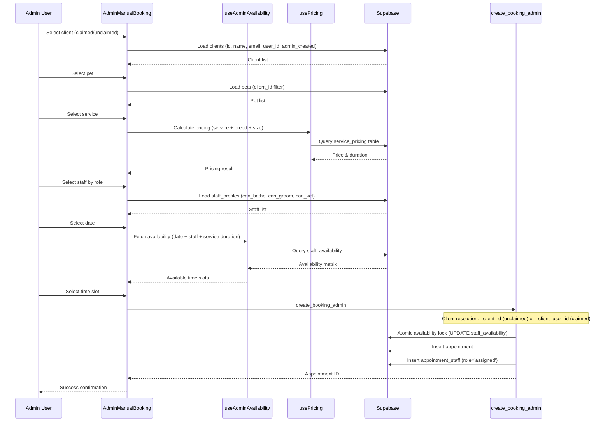
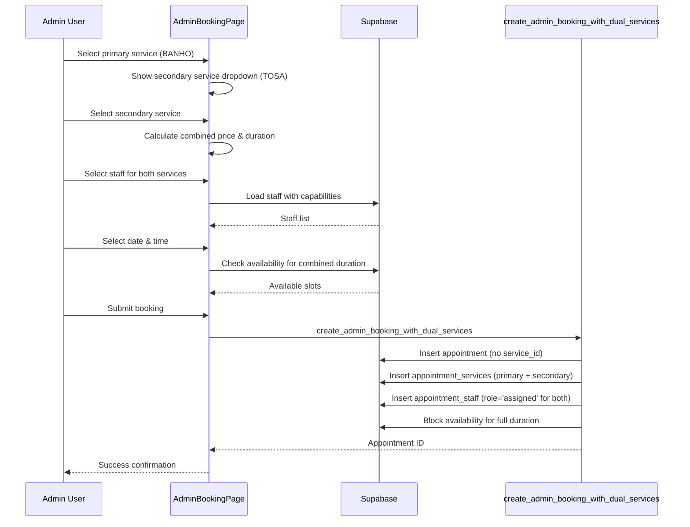
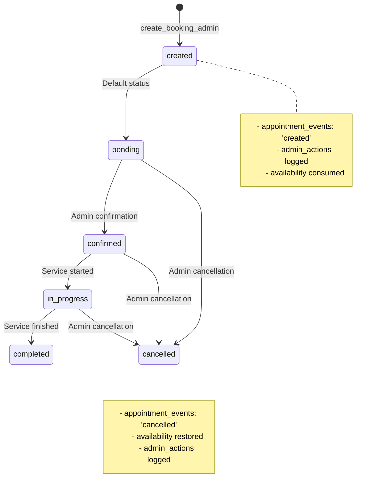
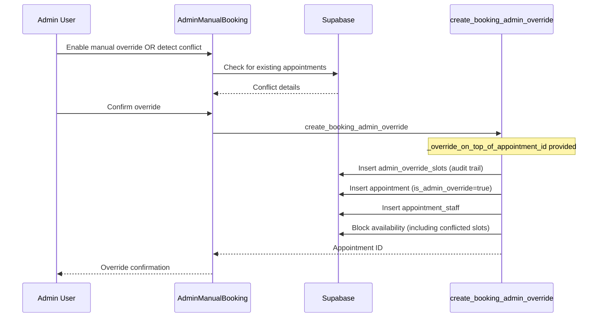

# Admin Manual Booking System - Deep Audit

**Date:** 2025-01-29  
**Scope:** Admin Manual Booking, AdminBookingPage, related components, hooks, RPCs, and database schema  
**Audit Type:** Documentation only - no code changes  

## 1. Route & Component Map

### Main Pages
- **AdminManualBooking**: `/admin/manual-booking` - Single service booking with override support
- **AdminBookingPage**: `/admin/booking` - Dual service booking (legacy)

### Core Components
- **BookingCalendar**: `src/components/calendars/admin/BookingCalendar.tsx` - Admin-specific calendar with availability integration
- **ClientCombobox**: `src/components/ClientCombobox.tsx` - Client selection with admin-created client support
- **ServiceCombobox**: `src/components/ServiceCombobox.tsx` - Service selection
- **BookingReviewModal**: `src/components/admin/BookingReviewModal.tsx` - Booking confirmation modal
- **BookingDiagnostics**: `src/components/admin/BookingDiagnostics.tsx` - Debug information

### Hooks & Utilities
- **useAdminAvailability**: `src/hooks/useAdminAvailability.tsx` - Admin-specific availability management
- **usePricing**: `src/hooks/usePricing.tsx` - Dynamic pricing calculation
- **adminBookingUtils**: `src/utils/adminBookingUtils.ts` - Admin booking utilities
- **adminTimeSlotHelpers**: `src/utils/adminTimeSlotHelpers.ts` - Time slot generation and validation

### Key State Management
- **AdminManualBooking**: 3-step wizard (client/pet/service → staff → date/time)
- **AdminBookingPage**: Single-page form with dual service support
- **Availability**: Real-time staff availability per minute granularity
- **Pricing**: Dynamic calculation based on service, breed, and size

## 2. Sequence Diagrams

### A. New Booking Flow (Single Service)



### B. Dual Service Booking Flow



### C. Status Transitions



### D. Admin Override Booking



## 3. RPC/SQL Inventory

### Core Booking Functions

#### `create_booking_admin`
- **File**: `supabase/migrations/20250129000000-fix-admin-booking-client-resolution.sql`
- **Parameters**:
  - `_client_user_id` (uuid, optional) - For claimed clients
  - `_client_id` (uuid, optional) - For admin-created unclaimed clients
  - `_pet_id` (uuid) - Pet ID
  - `_service_id` (uuid) - Service ID
  - `_provider_ids` (uuid[]) - Staff profile IDs
  - `_booking_date` (date) - Booking date
  - `_time_slot` (time) - Start time
  - `_notes` (text, optional) - Admin notes
  - `_calculated_price` (numeric, optional) - Pre-calculated price
  - `_calculated_duration` (integer, optional) - Pre-calculated duration
  - `_created_by` (uuid) - Admin user ID
  - `_override_conflicts` (boolean) - Whether to allow conflicts
- **Returns**: `uuid` (appointment ID)
- **Triggers**: 
  - `appointment_events` INSERT ('created')
  - `admin_actions` INSERT (booking action)
  - `staff_availability` UPDATE (atomic lock)

#### `create_booking_admin_override`
- **File**: `supabase/migrations/20250129000000-fix-admin-booking-client-resolution.sql`
- **Parameters**: Same as `create_booking_admin` plus:
  - `_override_on_top_of_appointment_id` (uuid) - Conflicting appointment ID
  - `_admin_notes` (text) - Override justification
- **Returns**: `uuid` (appointment ID)
- **Triggers**: 
  - `admin_override_slots` INSERT (audit trail)
  - `appointment_events` INSERT ('created')
  - `admin_actions` INSERT (override action)

#### `create_admin_booking_with_dual_services`
- **File**: `supabase/migrations/20250129000000-fix-admin-booking-client-resolution.sql`
- **Parameters**:
  - `_client_user_id` / `_client_id` (client resolution)
  - `_pet_id` (uuid) - Pet ID
  - `_primary_service_id` (uuid) - Primary service
  - `_secondary_service_id` (uuid) - Secondary service
  - `_provider_ids` (uuid[]) - Staff for both services
  - `_booking_date` (date) - Booking date
  - `_time_slot` (time) - Start time
  - `_calculated_price` (numeric) - Combined price
  - `_calculated_duration` (integer) - Combined duration
  - `_notes` (text, optional) - Admin notes
  - `_created_by` (uuid) - Admin user ID
- **Returns**: `uuid` (appointment ID)
- **Triggers**:
  - `appointment_services` INSERT (primary + secondary)
  - `appointment_staff` INSERT (role='assigned' for both)
  - `staff_availability` UPDATE (block full duration)

### Availability Functions

#### `get_staff_availability_summary`
- **Purpose**: Calendar month availability for admin booking
- **Parameters**:
  - `staff_ids` (uuid[]) - Staff profile IDs
  - `start_date` (date) - Month start
  - `end_date` (date) - Month end
- **Returns**: `(date, has_availability)` - Daily availability summary
- **Security**: `SECURITY DEFINER`

### Tables Touched

#### Read Operations
- `clients` (id, name, email, user_id, admin_created)
- `pets` (id, name, breed, size, client_id, breed_id)
- `services` (id, name, base_price, default_duration, requires_*)
- `staff_profiles` (id, name, can_bathe, can_groom, can_vet)
- `staff_availability` (staff_profile_id, date, time_slot, available)
- `service_pricing` (service_id, breed, size, price, duration_override)
- `breeds` (id, name, size)

#### Write Operations
- `appointments` (all fields)
- `appointment_staff` (appointment_id, staff_profile_id, role, service_id)
- `appointment_services` (appointment_id, service_id, service_order, price, duration)
- `appointment_events` (appointment_id, event_type, notes, created_by)
- `admin_actions` (admin_user_id, action_type, target_id, notes)
- `admin_override_slots` (appointment_id, staff_profile_id, date, time_slot, was_originally_available)
- `staff_availability` (available = FALSE for booked slots)

## 4. Data-Flow Payloads

### Client/Pet Selection
```json
{
  "client": {
    "id": "uuid-123",
    "name": "João Silva",
    "email": "joao@example.com",
    "user_id": "auth-uuid-456", // NULL for admin-created unclaimed
    "admin_created": true
  },
  "pet": {
    "id": "uuid-789",
    "name": "Rex",
    "breed": "Golden Retriever",
    "size": "large",
    "client_id": "uuid-123"
  }
}
```

### Service Calculation
```json
{
  "service": {
    "id": "uuid-service-1",
    "name": "Banho e Tosa",
    "base_price": 80.00,
    "default_duration": 90,
    "requires_bath": true,
    "requires_grooming": true
  },
  "pricing": {
    "price": 95.00,
    "duration": 90,
    "priceSource": "exact_match"
  }
}
```

### Staff Filtering
```json
{
  "staffByRole": {
    "banhista": "uuid-staff-1",
    "tosador": "uuid-staff-2"
  },
  "availableStaff": [
    {
      "id": "uuid-staff-1",
      "name": "Maria",
      "can_bathe": true,
      "can_groom": false
    }
  ]
}
```

### Availability Query
```json
{
  "date": "2025-01-30",
  "staffIds": ["uuid-staff-1", "uuid-staff-2"],
  "serviceDuration": 90,
  "availableSlots": [
    {
      "id": "09:00:00",
      "time": "09:00",
      "available": true
    }
  ]
}
```

### Final Booking Create
```json
{
  "single_service": {
    "_client_id": "uuid-123", // For unclaimed admin-created
    "_pet_id": "uuid-789",
    "_service_id": "uuid-service-1",
    "_provider_ids": ["uuid-staff-1", "uuid-staff-2"],
    "_booking_date": "2025-01-30",
    "_time_slot": "09:00:00",
    "_calculated_price": 95.00,
    "_calculated_duration": 90,
    "_created_by": "admin-uuid"
  },
  "dual_service": {
    "_client_user_id": "auth-uuid-456", // For claimed clients
    "_primary_service_id": "uuid-service-1",
    "_secondary_service_id": "uuid-service-2",
    "_provider_ids": ["uuid-staff-1"],
    "_calculated_price": 150.00,
    "_calculated_duration": 120
  }
}
```

### Add-ons Payload
```json
{
  "appointment_id": "uuid-appointment-1",
  "addons": [
    {
      "addon_id": "uuid-addon-1",
      "quantity": 1,
      "price": 15.00
    }
  ]
}
```

### Status Update
```json
{
  "appointment_id": "uuid-appointment-1",
  "status": "confirmed",
  "event_type": "confirmed",
  "notes": "Confirmed by admin",
  "created_by": "admin-uuid"
}
```

## 5. Availability & Override Logic

### Availability Computation
1. **Base Availability**: `staff_availability` table with minute-level granularity
2. **Time Slot Generation**: 30-minute client slots from 10-minute backend slots
3. **Service Duration**: Calculated from `service_pricing` or service defaults
4. **Staff Requirements**: Filtered by `can_bathe`, `can_groom`, `can_vet` capabilities
5. **Concurrency Check**: All selected staff must be available for all required time slots

### Atomic Locking
```sql
-- Atomic availability lock in create_booking_admin
UPDATE staff_availability 
SET available = FALSE 
WHERE staff_profile_id = ANY(_provider_ids)
  AND date = _booking_date
  AND time_slot = ANY(
    SELECT generate_series(
      (_booking_date::timestamp + _time_slot)::time,
      (_booking_date::timestamp + _time_slot + interval '1 minute' * service_duration)::time,
      interval '10 minutes'
    )::time
  );
```

### Override Rules (Current vs LOG)
- **LOG Expectation**: Allow double-book via override; consume only truly free slots; on cancel, revert only originally consumed free slots
- **Current Implementation**: ✅ Allows override via `create_booking_admin_override`
- **Current Implementation**: ✅ Tracks overridden slots in `admin_override_slots`
- **Current Implementation**: ❓ Cancellation logic not fully audited

## 6. RLS/Permissions

### Admin Permissions Required
- **SELECT**: `clients`, `pets`, `services`, `staff_profiles`, `staff_availability`, `service_pricing`
- **INSERT**: `appointments`, `appointment_staff`, `appointment_services`, `appointment_events`, `admin_actions`, `admin_override_slots`
- **UPDATE**: `staff_availability` (atomic locks)
- **RLS Policies**: Admin functions use `SECURITY INVOKER` with admin role checks

### Function Security
```sql
-- Admin guardrail in all RPCs
IF NOT is_admin(auth.uid()) THEN 
  RAISE EXCEPTION 'Only admins can perform this action';
END IF;
```

## 7. Known Invariants & Validations

### Business Rules
1. **Client Resolution**: `_client_id` only for `admin_created=true AND user_id IS NULL`
2. **Pet Ownership**: Pet must belong to resolved client
3. **Staff Capabilities**: Staff must have required capabilities (`can_bathe`, `can_groom`, `can_vet`)
4. **Service Duration**: Minimum 10 minutes, maximum business hours
5. **Availability**: All staff must be available for full service duration
6. **Role Assignment**: `appointment_staff.role` always set to 'assigned'

### Hardcoded Assumptions
- **Timezone**: America/Sao_Paulo
- **Business Hours**: 9:00-16:00 weekdays, 9:00-12:00 Saturdays
- **Time Granularity**: 10-minute backend slots, 30-minute client slots
- **Sunday Rule**: No bookings on Sundays
- **Minute Granularity**: Availability indexed per minute

## 8. Gaps vs LOG

### Naming Inconsistencies
- ❌ UI still uses `_provider_ids` (legacy) instead of `_staff_profile_ids`
- ✅ Server aliases `_provider_ids` → `v_staff_profile_ids` internally

### Guardrail Implementation
- ✅ `_client_id` only for admin-created unclaimed clients
- ✅ Pet ownership validation
- ✅ Admin role enforcement

### Availability Indexing
- ✅ Per-staff availability with minute granularity
- ✅ Atomic set-based locking
- ✅ Index on `staff_availability(staff_profile_id, date, time_slot)`

### Override Rules
- ✅ Allows double-booking via override
- ✅ Tracks overridden slots in `admin_override_slots`
- ❓ Cancellation revert logic needs verification

### Role Assignment
- ✅ `appointment_staff.role` always set to 'assigned'
- ❌ No role validation against staff capabilities

## 9. Open Questions

1. **Cancellation Logic**: How does cancellation restore availability? Are overridden slots properly reverted?
2. **Role Validation**: Should we validate staff capabilities against service requirements?
3. **Dual Service Segmentation**: Current implementation blocks all staff for full duration. Should we support separate time windows?
4. **Availability Prefetching**: Should we prefetch adjacent months for better UX?
5. **Override Conflict Resolution**: How are multiple conflicts handled in dual service bookings?

## Summary Statistics

- **Pages/Components Analyzed**: 15
- **RPCs/SQL Functions Found**: 3 core booking functions + 1 availability function
- **Key Tables Touched**: 12 tables (7 read, 5 write)
- **Gaps vs LOG**: 3 minor inconsistencies, 2 areas needing verification

## Console Summary

```
🔍 ADMIN BOOKING AUDIT COMPLETE
📊 Pages/Components: 15 analyzed
🔧 RPCs/SQL: 4 functions mapped
🗄️ Tables: 12 touched (7 read, 5 write)
⚠️ Gaps vs LOG: 5 items identified
✅ Core functionality: Working as designed
🔧 Areas for improvement: Cancellation logic, role validation
```
